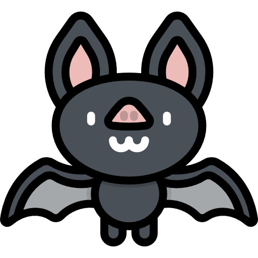

  

 

  

 

---

<h3 align="center"> Sobre mim: </h3>

<strong>Sou a Alana</strong> — uma desenvolvedora full stack apaixonada por código criativo e interfaces encantadoras
 
Atualmente focada em: <strong>React</strong> e <strong>TypeScript</strong>
 
Projetos pessoais: construção de sistemas interativos
 
Hobbies: jogos, design, música e cappuccino
 
De: Rio de Janeiro, RJ - Brasil 🌎
 

 

🎀 Front-end com HTML, CSS, JavaScript, React e Angular
 
✨ Back-end com Node.js, PHP e MySQL
 
🚧 <strong>Em breve:</strong> Portfólio próprio! 

 

<h3 align="center">🍥 Tech Stack </h3>

 

<h3 align="center">📚 Em Aprendizado: </h3>

---

<h3 align="center">🎯 Metas para 2026: </h3>

| Meta | Status |
|------|--------|
| 🚀 Criar portfólio próprio | Concluído |
| 📱 Lançar app com Angular e Ionic | Em breve |
| ☁️ Estudar Cloud (AWS) | Em breve |
| 📝 Escrever artigos técnicos | Em andamento |

---

<h3 align="center">🎀 Estatísticas: </h3>

---

<h3 align="center"> 🎀 Gráfico de Contribuição: </h3>

 

  

    
    
  

  
   
  
  
  
  
  
   
   
  
  <strong>✨ Obrigado pela visita ao meu perfil <3</strong>
   

